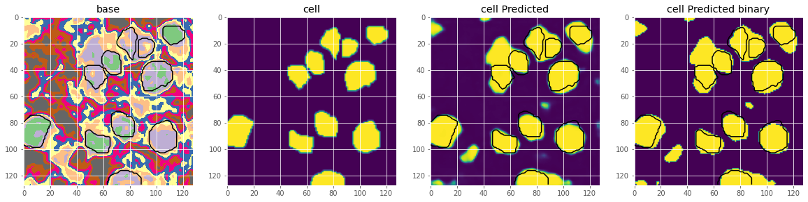
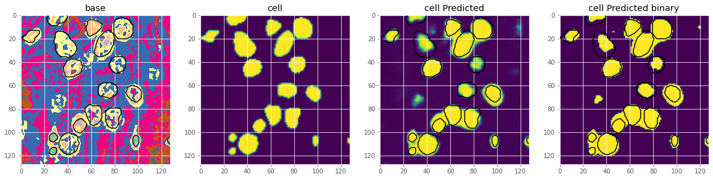
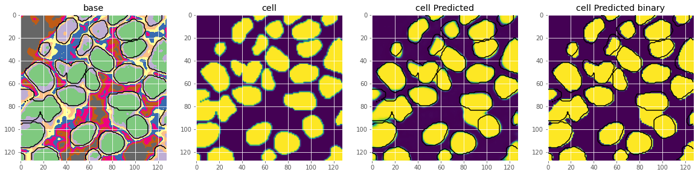

# DL3vsSEGvsUNET

This repository compares the performance of three convolutional neural networks on segmentation network.

* DeepLabV3Plus
* UNET
* SegNet

**What You Need to Know**

If you want to check the superimposed results along with all the graphs in one place, you need to check the notebook file **DL3vsSEGvsUNET.ipynb - Colaboratory.pdf** available in this repository.
         
**How to setup the environment** 

Run this on command to create a python virtual environment with the name CVSeg

**On Windows use --py-- instead of --python3--** 

`python3 -m venv CVSeg`

Shift your current environment to CVSeg by running this command

On macOS and Linux:

`source CVSeg/bin/activate`

On Windows:

`.\CVSeg\Scripts\activate`

Install the required python libraries

`pip3 install -r requirements.txt`

Images that are provided in dataset have the dimensions 1000x1000 which are too big. We need to divide the images in multiple patches of size 128x128 for which we first need to resize the image to 1024x1024 and then we need to extract 64 128x128 patches from 1024x1024 image and then we need to save this images data to cache folder so that these cache images can be used later. To do all this work, run the following command.

`python3 ./munge/preprocess.py`

**About the Dataset**

This dataset is used for Semantic segmentation of nuclei in digital histology images.
Monuseg dataset available at https://monuseg.grand-challenge.org/Data/

**How to train**

In order to train UNET, you need to run the following command.

`python3 trainUNet.py`

In order to train SegNet, you need to run the following command.

`python3 trainSegNet.py`

In order to train DeepLab V3+ , you need to run the following command.

`python3 trainDeepLabV3p.py`

Following commands will save the trained models to **trainedModels** folder with the file extensions **.h5** and the training graphs will be stored in **graphs** folder that will show you how model acquired accuracy after each epoch.

**How to Evaluate the saved models**

In order to Evaluate UNET, you need to run the following command.

`python3 evaluateUNet.py`

In order to Evaluate SegNet, you need to run the following command.

`python3 evaluateSegNet.py`

In order to Evaluate DeepLab V3+ , you need to run the following command.

`python3 evaluateDeepLabV3p.py`

Following commands will evaluate the trained models on the basis of following metrics. 

* Loss
* Accuracy
* F1 Accuracy
* IOU (Intersection over Union Coefficient)
* DICE Coefficient

Segmentation results of original UNET model.

     
     
     

